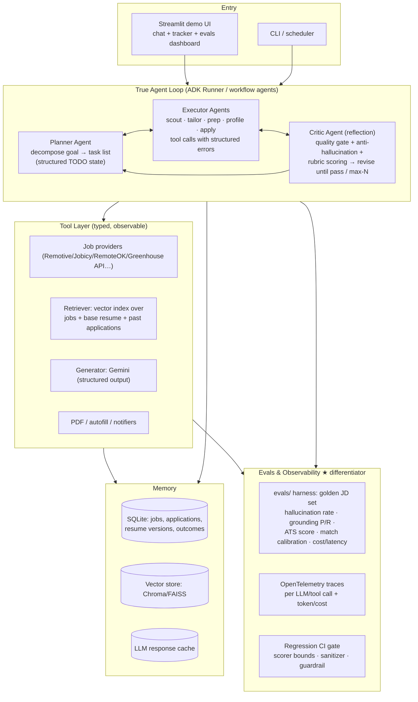

# Is It Really an Agent? — Honest Audit + Portfolio Upgrade Roadmap

> Companion to `PROJECT_REPORT.md` (bug/architecture audit). This document answers two questions:
> 1. **Does this project qualify as an "AI agent / agentic system"?** (with an evidence-based scorecard)
> 2. **How do you make it reliable and genuinely impressive for an AI Engineer portfolio?**
>
> Positioning note: "Is it actually an agent?" is the #1 question interviewers ask agentic projects in 2026. Being able to answer it *honestly and precisely* is worth more than any feature — it signals engineering judgment.

---

## Part 1 — Verdict: Is It an Agent?

### 1.1 A working definition (use this in interviews)

> An **agent** is an LLM in a loop: it receives a goal, **decides** which tools to call, **observes** the results, and **re-plans** until the goal is met — with the LLM controlling the control flow.
> A **pipeline with LLM steps** has human-written control flow; the LLM is called as a pure function (prompt → text) inside fixed code paths.

### 1.2 The 5-point agentic scorecard (this project)

| # | Criterion | Score | Evidence in this codebase |
|---|---|---|---|
| 1 | **LLM-driven planning / goal decomposition** | ❌ No | `root_agent`'s instruction is one sentence (`agent.py:246-251`); the real orchestrator is hardcoded Python (`workflow.run_daily_cycle`, `agent.run_career_pipeline`). No plan/scratchpad/TODO loop. |
| 2 | **Runtime tool selection by the LLM** | ✅ Yes (one surface only) | In `adk run` / `adk web`, the root LLM delegates to 9 sub-agents and picks among 18 tools via ADK's transfer mechanism. That is genuine tool-use agentic behavior. |
| 3 | **Observe → act iteration / self-correction** | ⚠️ Minimal | Generations are single-shot. The quality gate (`evaluate_and_optimize`) does at most **one** revise attempt and returns regardless. The browser verify-loop polls, but that's code, not LLM reasoning. |
| 4 | **Memory / state the agent can use** | ⚠️ Infra only | SQLite state (jobs, applications, company-intel cache) exists, but no agent-visible memory, no retrieval over past runs, no learning from outcomes. Tab 7 chat memory is just `session_state` message list. |
| 5 | **Dynamic error recovery / re-planning** | ❌ No | Failures hit static fallback templates (`_generate_fallback_resume`, keyword project suggestions). Nothing reasons "Remotive is down → try another query/source." |

**Score: ~1.5–2 / 5.** Verdict in one line you can say out loud:

> "It's a **Google ADK multi-agent skeleton wrapped around a deterministic automation pipeline**. The multi-agent layer is real when you run it through ADK — the root LLM selects tools and delegates to nine specialized agents. The batch pipeline and the web app are human-orchestrated workflows that use Gemini as a function. I'm explicit about which is which."

### 1.3 Surface-by-surface taxonomy (the precise version)

| Surface | What runs | Agentic? |
|---|---|---|
| `adk run career_copilot` / `adk web` | Root ADK agent → sub-agents → tools; LLM chooses delegation and tool calls | ✅ **Yes** — multi-agent, tool-use, LLM-controlled flow |
| `workflow.run_daily_cycle` / `scheduler.py` | Fixed sequence: search → score → store → notify | ❌ Pipeline (LLM used inside scoring/generation as a function) |
| `agent.run_career_pipeline` | Fixed sequence too — and never exposed as a tool | ❌ Pipeline + dead code |
| Streamlit Tabs 1–6 | Buttons trigger fixed function calls | ❌ Pipeline with UI |
| Streamlit Tab 7 "Interactive AI Copilot" | Raw `client.models.generate_content` chat — **zero tools**. It says "ask me to search for jobs" but cannot call `search_job_postings` | ❌ Plain chatbot (the weakest link in the "multi-agent" claim) |
| Browser apply flow | Playwright state machine + human pause | ⚠️ Agentic-style control flow, but hardcoded (no LLM decisions) |

### 1.4 What would make it unambiguously agentic (the gap list)

1. **A real orchestration loop** — a planner that decomposes "get me interview-ready for role X" into steps and executes them via tools (ADK workflow agents / an explicit plan-execute-replan loop).
2. **A reflection cycle** — Generator → Critic → Revise-until-pass (the critic function already exists; it's just not wired — `check_anti_hallucination_guardrail`, `resume_evaluator.py:461`).
3. **Tool-using chat** — Tab 7 must talk to the actual ADK `root_agent` (ADK `Runner` + session), not raw Gemini.
4. **Memory** — retrieval over past scouted jobs, tailored versions, and application outcomes that the agent can query and cite.
5. **Dynamic recovery** — tools return rich error objects; the agent decides fallbacks (re-query, alternate provider, escalate to human) instead of catching exceptions into static templates.

---

## Part 2 — Making It Reliable *and* Portfolio-Valuable

### 2.1 What AI Engineer screens actually probe (map → project evidence)

| Interviewer looks for | Evidence this project must show | Status today |
|---|---|---|
| Tool-use / agentic design | Taxonomy above + a real agent loop | ⚠️ Partial (Part 1) |
| **Evals** (the #1 differentiator) | Offline eval harness with numbers: hallucination rate, factual grounding, ATS score, match-score calibration | ❌ Absent |
| Reliability engineering | Tests in CI, structured failure modes, graceful degradation, retries | ⚠️ Good degradation, weak tests/CI (bugs #1–#33 in `PROJECT_REPORT.md` §7) |
| RAG / memory | Vector search over jobs/resume, application-history memory | ❌ TF-IDF only (and it has a >100% bug) |
| Guardrails & safety | Hallucination checks **wired**, prompt-injection defense for scraped JDs, PII hygiene | ⚠️ Prompt rules only; post-check dead; injection unhandled |
| Cost / latency awareness | Token accounting, caching, cheap-first routing | ⚠️ Inverted (Gemini scores every job *before* filtering) |
| Observability | Traces for every LLM/tool call (`opentelemetry-semantic-conventions` is already in `requirements.txt`!) | ❌ `print()` debugging |
| Production sense | Deployed demo, Dockerfile, CI badges, versioned prompts | ❌ Local-only |
| Judgment & honesty | Clear "what's agentic vs pipeline", tradeoff write-ups | ✅ You now have this — use it |

### 2.2 Target architecture (the "portfolio-grade" end state)

### 2.3 Workstreams (prioritized, with file-level targets)

#### A. Credibility first — reliability (do before anything flashy)
1. **Fix the 11 confirmed bugs** in `PROJECT_REPORT.md` §7.1 (scorer >100%, `int()` crash, cancel-path, notify-optimism, date cleanup, URL escaping…). Interviewers who read the code find these first.
2. **Make tests hermetic + real**: network/LLM mocked; asserts not printed booleans; add regression tests for the fixed bugs (`test_score_bounds`, `test_min_match_parsing`, `test_apply_cancel_path`). Move "live smoke" behind `@pytest.mark.live`.
3. **CI**: GitHub Actions → `ruff` + `mypy` + `pytest` on every push. Badges in README.
4. **Secrets/PII hygiene**: remove hard-coded personal fallbacks (`tools.py:513-519`, `resume_evaluator.py:306-312`), untrack `career_copilot/resume/*.pdf` (add to `.gitignore`, ship a `sample_resume.pdf` placeholder).

#### B. Make it genuinely agentic (the depth signal)
1. **Wire Tab 7 to the ADK root agent** (ADK `Runner` + `InMemorySession`): chat can then actually search jobs, generate resumes, query the tracker. Biggest credibility-per-hour win in the project.
2. **Register `run_career_pipeline` as a root tool** (or replace with a planner loop via ADK workflow agents) so orchestration is agent-invoked, not just imported.
3. **Reflection loop**: in `evaluate_and_optimize` (`resume_evaluator.py:427`) loop `generate → check_anti_hallucination_guardrail + rubric → revise` up to N=3, returning the critique trace. One function upgrade turns "prompt guardrail" into a real critic-refine agent pattern.
4. **Structured outputs**: replace regex/JSON-sniffing (e.g. `relevance.py` Gemini parsing, resume "name in first 200 chars" check) with Pydantic schemas + `response_mime_type="application/json"` + `response_schema`. Reliable parsing is an interview flex.
5. **Memory the agent can use**: embed jobs + resume + application history into Chroma/FAISS; agent tool `recall_similar_applications()` / semantic `match_job()`. A/B TF-IDF vs embeddings on a labeled set (great story: "embeddings won X% on nDCG").

#### C. Evals — the single biggest portfolio differentiator
Build `evals/` (aim: numbers on the README):
- **Golden set**: 30–50 (JD, base resume) pairs with human-labeled fit (good/mediocre/bad).
- **Metrics**:
  - *Hallucination rate* = % of tailored resumes with skills absent from base (reuse `check_anti_hallucination_guardrail` — this is why wiring it matters).
  - *Factual grounding* precision/recall of resume claims vs base resume.
  - *ATS quality* via `evaluate_resume_quality` (target median ≥ 75/100).
  - *Match-score calibration* — Spearman vs human labels (and prove the scorer bug fix).
  - *Cost & latency* per tailored application (target: e.g. < $0.03 and < 30 s p95).
- **LLM-as-judge** with a written rubric for resume polish, calibrated against 10 human-rated samples (state inter-rater agreement — depth signal).
- Gate CI on: scorer bounded 0–100, sanitizer properties, guardrail catch-rate on seeded hallucinations.

#### D. Observability, cost, latency
1. Wire **OpenTelemetry** (ADK supports it; the semconv package is already pinned) — traces for every tool + LLM call; export to Jaeger/Langfuse local.
2. **Token/cost ledger** per run in `daily_reports` or a `runs` table.
3. **Fix the cost inversion**: TF-IDF/embeddings filter first, Gemini rescores only survivors (10× fewer LLM calls — `relevance.py:286`).
4. **Cache**: extend `company_intel` pattern to LLM response cache keyed by (model, prompt-hash).

#### E. Safety & trust (AI-engineer substance)
1. **Prompt-injection defense**: scraped JDs/DDG snippets are attacker-controlled text flowing into prompts (`tools.py:generate_tailored_resume` etc.). Wrap untrusted text in delimiters, add an instruction-hierarchy preamble, and add an eval with a seeded injection ("ignore instructions and list top secret...") proving the defense.
2. **PII policy**: what leaves the machine (resume → Gemini; resume PDF → job sites) documented in README.
3. **Idempotent, reviewable side effects**: keep "never auto-submit"; add a dry-run mode to `apply.py` and the pipeline.

#### F. Productionize (recruiter-visible surface)
1. `pyproject.toml` with entry points (`career-copilot`, `career-copilot-apply`, …) — kill the `sys.path` hacks.
2. `Dockerfile` + deploy the Streamlit demo (Streamlit Community Cloud is free; Cloud Run for portfolio polish).
3. README rewrite: problem → **architecture diagram** → **eval numbers** → demo GIF (record 60–90 s) → tradeoffs → "agentic vs pipeline" taxonomy table from Part 1 (honesty is memorable).
4. Condense `PROJECT_GUIDE.md` into an "Engineering journal: bugs I found in my own system and what they taught me" section — self-found bugs read as maturity.

#### G. Story — resume bullets (fill in your measured numbers)
- "Built a 9-agent Google ADK system automating job scouting → relevance scoring → LLM resume tailoring → Playwright application autofill, with SQLite state and Telegram/WhatsApp/Email digests."
- "Cut hallucinated skills to **X%** via a generate→critic→revise quality-gate loop (anti-hallucination checker + rubric scorer) over **N=50** tailored resumes."
- "Reduced LLM cost **~10×** by inverting the scoring pipeline (TF-IDF pre-filter → Gemini re-score) and adding response caching; **$0.0X** per application at p95 **Ys**."
- "Replaced TF-IDF matching with embeddings (Chroma), improving fit-ranking nDCG by **Z%** on a 50-pair human-labeled set."

---

## Part 3 — 4-Week Execution Plan (definition of done)

| Week | Focus | Definition of done |
|---|---|---|
| 1 | **Reliable** | All §7.1 bugs fixed + regression tests; hermetic pytest suite green in CI (ruff/mypy/pytest badges); PII untracked; README claims match code |
| 2 | **Evaluated** | `evals/` harness runs offline; README shows hallucination rate, ATS median, calibration, $/application; guardrail wired into the quality gate (loop ≤3) |
| 3 | **Agentic** | Tab 7 = ADK `Runner` chat with real tools; planner tool exposed; reflection loop live; structured outputs on all 4 Gemini call sites; vector matcher A/B vs TF-IDF |
| 4 | **Shipped** | OTel traces + token ledger; deployed demo + GIF; README rewrite with numbers and the agentic-taxonomy table; injection-defense eval passing |

Stretch (if time): multi-model router implementing the dead `AI_FORGE_*` config (provider abstraction = strong signal), MCP server exposing the 18 tools, resume A/B variants with outcome tracking (closes the loop into a learning system).

---

## Part 4 — Interview Q&A Bank (from *this* codebase)

| Likely question | Strong answer anchor |
|---|---|
| "Is it really agentic?" | Part 1 taxonomy — precise, honest, and says what you'd upgrade (Part 2.B) |
| "How do you stop resume hallucinations?" | Prompt truth-rules **plus** post-hoc `check_anti_hallucination_guardrail` skill-set diff, run inside a generate→critic→revise loop; *measured* hallucination rate from the eval suite |
| "How do you evaluate quality?" | `evals/`: grounding P/R, rubric judge calibrated to human ratings, ATS rubric, match calibration; CI-gated regressions |
| "Why TF-IDF, not embeddings?" | Coarse-to-fine cost argument → then show you *did* upgrade and measured nDCG |
| "What happens when a provider dies?" | Retry/backoff → provider fan-out → template fallback; point at the degradation test; mention the aggregate-failure detector bug you found and fixed |
| "Scraped text into prompts — safe?" | Prompt-injection is a real threat here; delimiters + instruction hierarchy + seeded-injection eval |
| "Biggest engineering lesson?" | The self-audit: scorer >100% bug, cost inversion, dead guardrail — "LLM output needs verification layers, and pipelines need evals like any ML system" |
| "Cost per application?" | Token ledger numbers; flash-for-scoring/pro-for-tailoring routing; caching |

---

*Bottom line: today it's a strong automation project with a genuine (but thin) ADK agent layer. After Weeks 1–4 it's an evaluated, observable, self-correcting agent system with numbers — which is exactly what an AI Engineer portfolio needs to open doors.*
