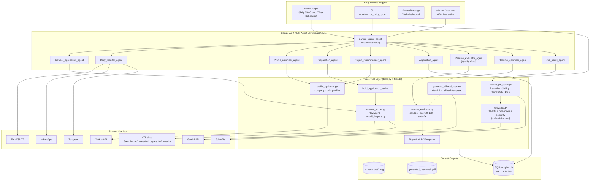
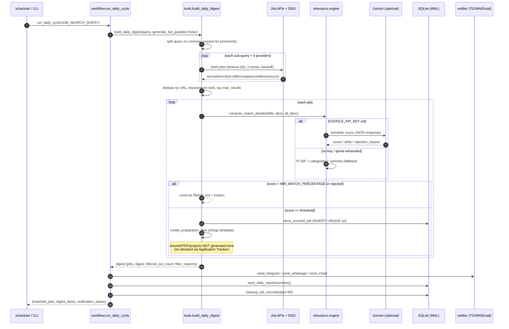
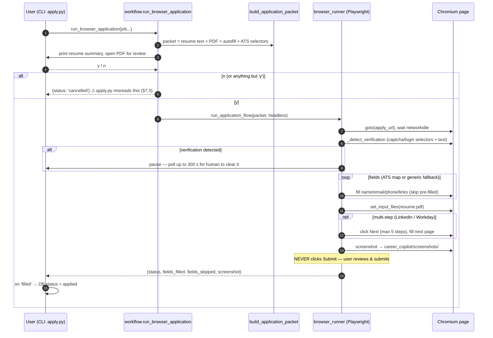
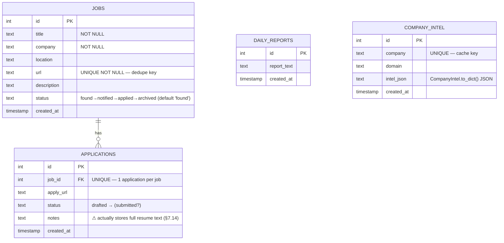

# Career Copilot — Comprehensive Project & System-Design Report

> **Repository:** `Jaganravi131/Resume-agent` · **Branch:** `arena/01a0c85d-resume-agent` (from `main` @ `86261c5`)
> **Report date:** 2026-09-22 · **Code size:** ~5,900 lines across 17 Python modules + 2 docs
> **Method:** full source read-through of every module, plus empirical verification (unit-test runs and bug reproductions — see §6).

---

## Table of Contents

1. [Executive Summary](#1-executive-summary)
2. [What the Project Does](#2-what-the-project-does)
3. [Tech Stack](#3-tech-stack)
4. [Repository / Module Map](#4-repository--module-map)
5. [System Design (Diagrams)](#5-system-design-diagrams)
6. [Verification & Test Results](#6-verification--test-results)
7. [Errors & Bugs Found](#7-errors--bugs-found)
8. [Partial / Incomplete Work](#8-partial--incomplete-work)
9. [Recommendations (Suggested Fix Order)](#9-recommendations-suggested-fix-order)
10. [How to Run](#10-how-to-run)

---

## 1. Executive Summary

**Career Copilot** is a multi-agent AI job-search automation system built on **Google ADK + Gemini**. It scouts live jobs from public boards, scores them against your resume with a TF-IDF relevance engine (optionally Gemini-scored), tailors resumes per job with anti-hallucination prompts, exports ATS-friendly PDFs, fills application forms via Playwright (human-in-the-loop), tracks everything in SQLite, and sends daily digests over Telegram / WhatsApp / Email. It ships with a 7-tab Streamlit dashboard.

**Overall assessment:** the architecture is well-conceived (clear separation of scouting / scoring / generation / notification, a quality-gate pattern, on-demand expensive operations, graceful LLM→template fallbacks), and the offline test suite (14/14) passes. However, the codebase contains **several confirmed runtime bugs** (a scoring engine that can emit scores >100%, a crash on malformed config, an unreachable cancel path in the apply CLI), **a number of documented-but-not-wired features** (the anti-hallucination post-check, the "7-day Q&A prep plan", a full-pipeline tool never exposed to the agent), and **significant documentation drift** (wrong env-var names in the guide, claims that contradict the code). Section 7 lists 25 issues with file/line evidence; Section 8 lists 14 partial-work items.

---

## 2. What the Project Does

| Capability | Implementation | Status |
|---|---|---|
| Live job scouting | Remotive API, Jobicy API, RemoteOK API, DuckDuckGo HTML scrape (Greenhouse/Lever/Ashby) | ✅ works (degrades gracefully offline) |
| Relevance scoring | TF-IDF + skill categories + seniority detection; optional Gemini semantic scorer | ⚠️ works, but has a >100% scoring bug (§7.1) |
| Seniority-aware search | Query expander appends "junior/entry/graduate/…" variants for junior targets | ✅ |
| Resume tailoring | Gemini rewrite with anti-hallucination prompt + keyword-template fallback | ✅ (post-check not wired — §7.5) |
| ATS quality gate | Sanitizer (paths/debug/fences) + 100-pt rubric + Gemini re-polish below 70 | ✅ |
| PDF export | ReportLab, styled 1–2 page ATS layout | ✅ |
| Application packets | Resume + PDF + autofill payload + ATS-specific selectors in one call | ✅ |
| Browser autofill | Playwright; detects CAPTCHA/login and pauses for human; multi-step "Next" handling; **never clicks Submit** | ✅ (cancel path buggy — §7.3) |
| Application tracking | SQLite (`copilot.db`): jobs, applications, daily_reports, company_intel | ✅ |
| Notifications | Telegram Bot API, Meta WhatsApp Graph API, SMTP email (with chunking + HTML-escape) | ✅ |
| Scheduling | Long-running `scheduler.py` loop + Windows Task Scheduler installer | ✅ (Windows-centric) |
| Web dashboard | Streamlit, 7 tabs: architecture showcase, scout, ATS evaluator, tailor+PDF, interview/profile, tracker, AI chat | ✅ |

---

## 3. Tech Stack

| Layer | Technology |
|---|---|
| Agent framework | Google ADK (`google-adk`) — 1 root agent + 9 sub-agents |
| LLM | Google Gemini (`google-genai`), model from `GEMINI_MODEL` (default `gemini-2.5-flash`) |
| Scoring | Pure-Python TF-IDF + skill taxonomy (no sklearn) |
| PDF | ReportLab (render) + pypdf (extract/validate) |
| Browser automation | Playwright (Chromium) |
| UI | Streamlit + pandas + custom CSS (dark indigo theme) |
| Persistence | SQLite in WAL mode (`copilot.db`) |
| Notifications | Telegram Bot API, WhatsApp Cloud API v19, SMTP/TLS |
| Scheduling | `scheduler.py` busy-loop (30 s) + `install_task.ps1` (Windows Task Scheduler) |
| Config | Hand-rolled `.env` loader (`config.load_env`), no `python-dotenv` dependency |

---

## 4. Repository / Module Map

```
Resume-agent/
├── README.md                    User-facing docs (setup, commands, troubleshooting)
├── PROJECT_GUIDE.md             Build log / design notes / lessons / roadmap
├── requirements.txt             8 pinned deps (google-adk, google-genai, pypdf, reportlab,
│                                playwright, streamlit, pandas, opentelemetry-semantic-conventions)
├── .streamlit/config.toml       Dark theme, headless, XSRF on
└── career_copilot/
    ├── __init__.py              Loads .env, exposes root_agent & workflow entry points
    ├── agent.py                 9 ADK sub-agents + root orchestrator (256 ln)
    ├── tools.py                 Core tools: search, resume, packets, digest (1,044 ln)
    ├── relevance.py             TF-IDF + category + seniority scoring engine (435 ln)
    ├── resume_evaluator.py      Quality gate: sanitize / score / optimize / PDF validate (483 ln)
    ├── profile_optimizer.py     Company intel + LinkedIn/GitHub/Portfolio optimizer (1,019 ln)
    ├── autofill_helpers.py      ATS selector maps: LinkedIn, Greenhouse, Lever, Workday, Ashby
    ├── browser_runner.py        Playwright engine: verify-pause, fill, screenshot
    ├── workflow.py              CLI pipelines: daily cycle, browser apply, profile opt
    ├── database.py              SQLite CRUD + WAL + 90-day cleanup
    ├── notifier.py              Telegram / WhatsApp / Email senders (chunking, mocking)
    ├── config.py                .env loader, STOPWORDS, HTTP retry helpers, model name
    ├── app.py                   Streamlit dashboard (7 tabs, 469 ln)
    ├── apply.py                 CLI: apply by job ID (human-in-the-loop)
    ├── scheduler.py             Daily scheduler loop
    ├── install_task.ps1         Windows Task Scheduler registration
    ├── run_tests.py             Test runner (mocks google.adk)
    ├── test_career_copilot.py   14 unit tests + integration smoke (500 ln)
    ├── test_evaluator.py        Sanitizer/evaluator smoke test
    └── resume/                  Base resume PDFs (Resume_latest.pdf + Resume (1).pdf)
```

---

## 5. System Design (Diagrams)

### 5.1 High-Level Architecture



ASCII fallback (as designed in `README.md`, corrected to include the 9th agent):

```
┌────────────────────────────────────────────────────────────────────────────┐
│                       Career_copilot_agent (Root / ADK)                    │
│              Delegates to 9 specialized sub-agents by query                │
├────────┬─────────┬─────────┬─────────┬────────┬────────┬─────────┬────────┬────────┐
│ Scout  │ Resume  │ Resume  │ Appli-  │ Project│ Prep   │ Profile │ Daily  │Browser │
│ Agent  │ Optim.  │ Eval.   │ cation  │ Recom. │ Agent  │ Optim.  │ Monitor│ Agent  │
│        │ Agent   │ Agent   │ Agent   │ Agent  │        │ Agent   │ Agent  │        │
└────────┴─────────┴─────────┴─────────┴────────┴────────┴─────────┴────────┴────────┘
    │         │         │          │         │        │         │        │        │
    ▼         ▼         ▼          ▼         ▼        ▼         ▼        ▼        ▼
 Live Job   Gemini   Sanitize   Record   Company  Prep    LinkedIn  Telegram Playwright
 APIs +     Tailor   + Score    Appli-   Aligned  Plans &  GitHub   WhatsApp Form Fill
 TF-IDF     Resume   Gate 70    cations  Projects Q&A*    Portfolio Email   (human pause)
                                       (* = partially implemented, see §8)
```

### 5.2 Agent ↔ Tool Topology

```mermaid
flowchart LR
    subgraph ADK_Agents
        S["Job_scout_agent"]
        R["Resume_optimizer_agent"]
        E["Resume_evaluator_agent"]
        AP["Application_agent"]
        PR["Project_recommender_agent"]
        P["Preparation_agent"]
        PF["Profile_optimizer_agent"]
        D["Daily_monitor_agent"]
        B["Browser_application_agent"]
    end
    S --> T1["search_job_postings"]
    S --> T2["store_scouted_job"]
    S --> T3["compute_match_percentage"]
    R --> T4["generate_tailored_resume"]
    R --> T5["export_resume_pdf"]
    R --> T6["build_application_packet"]
    R --> T7["get_autofill_mapping"]
    E --> T8["evaluate_resume_quality"]
    E --> T9["sanitize_resume_text"]
    E --> T10["evaluate_and_optimize"]
    E --> T11["validate_pdf_output"]
    AP --> T12["record_application"]
    PR --> T13["recommend_projects"]
    P --> T14["create_preparation_plan"]
    PF --> T15["generate_profile_updates"]
    PF --> T16["analyze_target_company"]
    D --> T17["notify_user_of_matches"]
    B --> T18["run_application_flow"]
    R -. "writes" .-> PDF[("PDF files")]
    T12 -. "notes column" .@ DB[("SQLite")]
```

### 5.3 Daily Pipeline (Sequence)



### 5.4 Resume Generation Quality-Gate Flow

```mermaid
flowchart TD
    A["generate_tailored_resume(title, company, desc)"] --> B["Extract base resume text<br/>from Resume_latest.pdf (cached)"]
    B --> C{GOOGLE_API_KEY?}
    C -- yes --> D["Gemini prompt with<br/>ANTI-HALLUCINATION RULES"]
    D --> E{Looks like a resume?<br/>(name in first 200 chars)}
    E -- yes --> H["evaluate_and_optimize()"]
    E -- no --> F["fallback template"]
    C -- no --> F["_generate_fallback_resume<br/>(keyword template)"]
    F --> H
    subgraph Gate ["Quality Gate (resume_evaluator.py)"]
        H --> I["sanitize_resume_text<br/>(paths, fences, [Tool] lines, JSON, Keywords:)"]
        I --> J["evaluate_resume_quality<br/>5-axis rubric: cleanliness 25 / structure 25 /<br/>contact 15 / content 20 / length 15"]
        J --> K{score ≥ 70?}
        K -- yes --> M["return clean text"]
        K -- no --> L["optimize_resume_for_role<br/>(Gemini re-polish with issues list)"]
        L --> N["re-evaluate"]
        N --> M
    end
    M --> O["_export_resume_pdf_from_text<br/>(final sanitize + ReportLab render)"]
    O --> P[("generated_resumes/resume_*.pdf")]
    Q["check_anti_hallucination_guardrail()"] -. "⚠ NEVER CALLED (see §7.5)" .-> M
```

### 5.5 Browser Auto-Apply Flow (Human-in-the-Loop)



### 5.6 Data Model (SQLite `copilot.db`)



**Key patterns:** `url UNIQUE` + `INSERT`/`IntegrityError` swallow = silent dedupe across daily runs; `journal_mode=WAL` + `timeout=10` = scheduler/UI concurrency; `ON CONFLICT DO UPDATE` upserts for applications and company intel.

### 5.7 Design Patterns In Use

| Pattern | Where | Comment |
|---|---|---|
| **Multi-agent delegation** (ADK) | `agent.py` — root + 9 scoped sub-agents | Root has *no* tools; orchestration is LLM-driven transfer only |
| **Quality gate / guardrail** | `resume_evaluator.evaluate_and_optimize` intercepts all generated resumes | Sound; but the anti-hallucination *checker* is not wired (§7.5) |
| **Coarse-to-fine scoring** (cheap → expensive) | TF-IDF pre-filter… *in theory* | Contradicted in practice: Gemini scores every job before filtering (§7.2) |
| **On-demand expensive ops** | `build_daily_digest(generate_full_packets=False)` default | Good — avoids burning LLM tokens on unrequested resumes |
| **Graceful degradation** | Every Gemini call falls back to template/heuristic on error/429 | Consistent across tools |
| **Human-in-the-loop** | Browser flow pauses at CAPTCHA/login; never auto-submits | Deliberate safety design |
| **Cache layer** | resume text process-cache; `company_intel` table cache | `load_env` also idempotent |
| **UNIQUE-as-dedup** | `jobs.url`, `applications.job_id`, `company_intel.company` | Clean idempotency strategy |
| **Sanitize-at-boundary** | PDF export re-sanitizes text one final time | Defense in depth against LLM artifacts |

---

## 6. Verification & Test Results

Environment: Python 3.11.2, venv with `pypdf` + `reportlab` (full `requirements.txt` not installable in this sandbox — PEP 668; `google-adk` mocked as `run_tests.py` does). Outbound HTTPS from the sandbox is TLS-blocked, so live job-provider calls could not be exercised here (all 4 providers fail → graceful empty result, which itself validated the degradation path).

| Suite | Result | Notes |
|---|---|---|
| `career_copilot/test_evaluator.py` (stdlib-only smoke) | ✅ **PASS** | Sanitizer strips paths/fences/[Tool]/metadata; evaluator scored sample 87/100 |
| `test_career_copilot.py` — 14 offline unit tests | ✅ **14/14 PASS** | autofill detection 7/7, packet enrichment, browser graceful degradation, relevance good=97% / bad=22%, experience filter, thresholds, negative keywords, fresher filter, company intel, 3 optimizers, DB caching, cleanup, resume caching |
| `python -m compileall career_copilot` | ✅ clean | No syntax errors anywhere |
| Bug reproductions (§7) | ✅ 5/5 confirmed | category score 400%, Gemini branch short-circuit, cancel-path miss, `int()` crash, dead guardrail |
| Live search (`search_job_postings`) | ⚠️ 0 results in sandbox | TLS egress blocked here; retry/backoff and empty-result handling worked as coded |

Notable observation during testing: the "good match" test reported `category scores: {'languages': 200, ...}` — scores above 100% leaked straight through (see §7.1).

---

## 7. Errors & Bugs Found

> **Errata (2026-09-22):** the following items have since been **fixed** — see `git log` and §11:
> #1 (category >100%), #2 (Gemini short-circuit + bare except), #3 (apply cancel path), #4 (MIN_MATCH crash),
> #5 (guardrail dead code → wired into the revise loop), #6 (notify-optimism), #7 (cleanup date formats),
> #8 (URL attribute escaping), #9 (DDG failure accounting), #10 (matched_jobs semantics), #11 (truncation warning),
> #12 (7-day prep plan implemented), #13 (run_career_pipeline exposed as root tool), #14 (resume_text column),
> #15 (status vocabulary validated), #16 (PII centralized via `config.get_candidate_profile`), #17 ([Tool] print → logger),
> #18 (sidebar raw SQL → database helpers), #19 (slider mislabel), #20 (coarse-to-fine LLM rescoring),
> #21 (streamlit pin + pytest), #22 (hermetic tests + regression suite). Doc items #23–#31 also addressed.
> **§8 partial-work items since resolved:** §8.1 (7-day plan + Q&A), §8.2 (guardrail wired), §8.3 (pipeline tool exposed),
> §8.4 (`filter_jobs_by_relevance` is now the digest's Phase-1 gate — no more hand-rolled loop), §8.5 (`AI_FORGE_*` vars
> removed), §8.7 (`scheduler --once`: cron/systemd-friendly single-run mode), §8.8 (`GITHUB_USERNAME` in `.env.example`),
> §8.9 (DDG parser rewritten attribute-order tolerant — markup shuffles no longer yield silent zero results; **plus** board
> jobs are now enriched with authoritative data from the official Greenhouse/Lever public APIs, scraped = fallback),
> §8.11 additionally: the apply CLI now gates job='applied' behind explicit submit confirmation (filled ≠ submitted);
> §8.12's resume-versioning gap is closed: immutable per-application `resume_versions` history (append-on-change)
> with the `get_resume_version_history` agent tool,
> §8.10 (Jobicy tries the full query phrase before the first-keyword fallback), §8.11 (application status machine:
> `ALLOWED_APPLICATION_STATUSES` + `update_application_status`, invalid values rejected/coerced). §8.12 stays intentional
> (human-in-the-loop submit).
> **Post-audit criticals sweep (deep reliability pass beyond the listed items):** fixed + pinned —
> (a) `smtplib.SMTP` had **no timeout**: a hung SMTP server froze the daily scheduler thread forever (silent total
> automation failure) → bounded 15s; (b) external job titles flowed into filenames: fully non-ASCII titles sanitized to
> an empty string (every such job overwrote `resume_.pdf`) and 255-byte+ names could crash the digest → truncate +
> content-hash suffix; (c) a regression test itself used `add_job`'s bool return as an id (false-green pin) → re-SELECT.
> Swept and verified clean: TF-IDF/category division guards, `_get_min_match` crash-safety, browser-runner best-effort
> probes, Telegram/WhatsApp 10s timeouts, `fetch_with_retry` 20s default, filename path traversal (allowlist charset).
> **Reliability pass 2 (latency & cache classes):** (a) `analyze_company` short-circuits dead domains — the 4
> about-page attempts are skipped when the homepage fetch failed (was: ~15s × 2 retries × 5 fetches ≈ 2.5 min burned
> per dead company in a digest); (b) company-intel cache had **no TTL and no freshness guard** — one outage-day fetch
> poisoned intel forever → 7-day TTL (`INTEL_CACHE_TTL_DAYS`) + unreachable-domain results are never cached;
> verified: `call_gemini` failover chain, GitHub repo fetch (bounded, defensive), app.py network calls all
> button-gated (no rerun-time storm).
> **Reliability pass 3 (loop & migration classes):** (a) critique-revise loop made **no-progress LLM calls** — when
> the reviser is a no-op (LLM down) it returned the identical text, which was then re-evaluated up to
> `max_attempts-1` times per resume → identical revisions now break the loop after one attempt;
> (b) legacy-DB migration path verified: pre-fix `applications` tables (no `resume_text`) upgrade via `ALTER TABLE`,
> `init_db` is idempotent, legacy rows (resume-in-notes era) preserved and upsert cleanly. Verified clean:
> revise-loop crash-safety (sanitized fallback), sanitize/quality-gate defensiveness, Telegram/WhatsApp chunking
> (3500 chars). Evals extended to 12 checks (revise-loop no-progress, intel-cache anti-poison, filename safety).
> Each fix is pinned by a `test_regressions.py` test (18 regression + 11 offline = 29/29).
> Rows below are preserved as the original findings.

Severity: 🔴 High (wrong/crashing behavior) · 🟠 Medium (logic flaw / broken promise) · 🟡 Low (hygiene / drift).

### 7.1 Confirmed runtime bugs

| # | Sev | Location | Bug | Evidence |
|---|---|---|---|---|
| 1 | 🔴 | `relevance.py:247-257` `_score_categories` | **Category scores can exceed 100%** — `matched` counts duplicate job tokens while `unique_job` dedupes the denominator (`python` ×4 in JD vs 1 unique → 400%). Inflates `category_avg` and the composite match score (a mediocre fit can cross `MIN_MATCH_PERCENTAGE` falsely). | Repro: `_score_categories(_tokenize("Python python python developer with python scripting"), _tokenize("Python developer"))` → `{'languages': 400}`; test output showed `languages: 200` |
| 2 | 🟠 | `relevance.py:286-355` `compute_relevance_score` | **Gemini branch short-circuits the entire fallback**: when `GOOGLE_API_KEY` is set, every job is sent to Gemini (1 API call per job *before* threshold filtering — opposite of the documented coarse-to-fine design, §7.20) and `category_scores` / `tfidf_score` are left empty. On any exception the code does a bare `pass` (swallows quota *and* programming errors; `exc` unused). | Source inspection: `return result` occurs inside the Gemini branch before the `FALLBACK` marker |
| 3 | 🟠 | `apply.py:63-68` | **User-cancel branch is unreachable**: `run_browser_application` returns `{"status": "cancelled", "browser_result": None}` on cancel, but `apply.py` reads `result["browser_result"]["status"]` → `"unknown"`, so `if status_result == "cancelled": sys.exit(0)` never fires and the CLI silently falls through with no message. | Repro simulation: `status_result == 'cancelled'` → `False` |
| 4 | 🟠 | `tools.py:982` (`build_daily_digest`) | **Crash on malformed config**: `int(os.environ.get("MIN_MATCH_PERCENTAGE", "40"))` has no try/except; a value like `40%` or empty string raises `ValueError` and kills the whole daily cycle. Ironically `relevance._get_min_match()` is a safe parser for exactly this, but is not used here. | Repro: `int("40%")` → `ValueError: invalid literal for int()` |
| 5 | 🟠 | `resume_evaluator.py:461` `check_anti_hallucination_guardrail` | **Dead code / broken promise**: PROJECT_GUIDE §8 claims a post-generation `validate_no_hallucinated_skills()` check; the real function has a different name and is **never called** anywhere in the pipeline. Anti-hallucination exists only as prompt text. Repro shows the function works (`"Kubernetes"` in tailored-but-not-base correctly flagged) — it's just not wired in. | `grep` shows exactly 1 occurrence (the definition) |
| 6 | 🟠 | `agent.py:73-76` `notify_user_of_matches` | **Jobs marked 'notified' even when every send fails** (unconfigured creds → all three return `False`). Docstring claims "updates their status to 'notified' after successful delivery" — not true. These jobs then leave the 'found' set and may never be re-notified. | Code: status update loop runs unconditionally after the three `send_*` calls |
| 7 | 🟡 | `database.py:180-186` `cleanup_old_records` | **Date-format comparison bug**: cutoff is `datetime.now().isoformat()` (`2026-06-24T08:00:00`) compared as *strings* against SQLite `CURRENT_TIMESTAMP` rows (`2026-06-24 08:00:00`). `' '` < `'T'`, so rows created on the cutoff day are deleted even if *newer* than the cutoff. | Format mismatch visible in source |
| 8 | 🟡 | `agent.py:57` | Email digest builds `<a href='{url}'>` from job URLs **without HTML-escaping the attribute** (title/company/desc are escaped, the URL is not) — malformed/hostile URLs can break or inject markup. | Source |
| 9 | 🟡 | `tools.py:449-460` | **"All providers failed" detector has a hole**: `_search_ddg_job_boards` swallows its own errors and returns `[]` instead of raising, so `provider_errors == total_providers` can never be true; the top-level "check your network" error log never fires. | Source + live run (DDG returned `[]`, no aggregate error logged) |
| 10 | 🟡 | `workflow.py:113`, `agent.py:128` | Return key `matched_jobs` is `len(digest["jobs"])` — i.e. **total fetched**, not matched/passed. Misleading in every consumer. | Source |
| 11 | 🟡 | `tools.py:147-163` `_extract_resume_text` | Silent 6,000-char truncation of the base resume; long resumes lose their tail (education, later jobs) from both tailoring and scoring. | Source |

### 7.2 Logic flaws & design inconsistencies

| # | Sev | Location | Issue |
|---|---|---|---|
| 12 | 🟠 | `app.py:317-330, 396` vs `tools.py:847-853` | **"7-Day Interview Prep Guide … and anticipated technical Q&A"** (UI text, agent matrix, PROJECT_GUIDE) vs `create_preparation_plan`, which is a static 4-bullet generic template with zero LLM calls and zero Q&A. See §8.1. |
| 13 | 🟠 | `agent.py:78-128` | `run_career_pipeline` (search → score → packets → record → notify) is fully written but **never registered as an ADK tool** — `root_agent` has `sub_agents` only, `tools=[]`. Dead orchestrator path (see §8.3). |
| 14 | 🟡 | `tools.py:951-953` | `record_application(job_id, apply_url, resume_text)` stores the **full resume text in the `notes` column** — schema/comment drift and DB bloat. |
| 15 | 🟡 | `app.py:370` vs `database.py:84-96` | Job-status vocabulary inconsistent: UI offers `drafted` / `interviewing` for **jobs**, but the documented lifecycle is `found → notified → applied → archived`, and `get_actionable_jobs` silently treats anything outside `('found','notified')` as done — marking a job "drafted" in the UI drops it out of the pipeline. |
| 16 | 🟡 | `tools.py:513-519`, `resume_evaluator.py:306-312` | Author's real name/email/phone/LinkedIn/GitHub/portfolio hard-coded as fallback defaults in multiple modules — a config smell (and privacy hazard) if env vars are missing. |
| 17 | 🟡 | `tools.py:415`, `resume_evaluator.py:39` | `search_job_postings` uses `print("[Tool] …")` instead of logging; the sanitizer carries a regex (`^\[Tool\].*$`) specifically to scrub these lines when they leaked into resumes — debug residue, two wrongs. |
| 18 | 🟡 | `app.py:105-113` | Sidebar telemetry uses **raw SQL** (`c.execute("SELECT COUNT(*)…")`) — violating PROJECT_GUIDE §12's own rule "Don't use raw sqlite3 directly in app.py". |
| 19 | 🟡 | `app.py:268` vs `tools.py:408-413` | Tab-2 slider labeled "Max Results **per Source**" is passed as `max_results` which caps the **total** across all sources. |
| 20 | 🟡 | PROJECT_GUIDE §9:436 vs `relevance.py:286-355` | Guide claims "TF-IDF first-pass filter … Gemini **second-pass** deep scorer **only for jobs that passed the threshold**." Code does the opposite: Gemini scores every job first and returns before TF-IDF ever runs. Cost + determinism implications. |
| 21 | 🟡 | `requirements.txt:1-11` | `st.dataframe(width="stretch")` (`app.py:356-360`) needs Streamlit ≥ ~1.49, but requirements pin `streamlit>=1.30.0`; `pytest` is used in the README testing flow but not declared. |
| 22 | 🟡 | `test_career_copilot.py` (various), `run_tests.py` | Tests are not hermetic: `test_workflow` performs **live network calls and real notification sends** (would post to actual Telegram/WhatsApp/Email when configured); several tests `return True` even on soft failure (e.g. `test_experience_level_filter`); `run_tests.py` never runs `test_evaluator.py`. |

### 7.3 Documentation drift (claims ≠ code)

| # | Sev | Location | Issue |
|---|---|---|---|
| 23 | 🟠 | `PROJECT_GUIDE.md:503-508` | **Wrong env-var names** in the guide's `.env` sample: `WHATSAPP_API_KEY` / `WHATSAPP_PHONE_NUMBER` / `EMAIL_SENDER` / `EMAIL_PASSWORD` / `EMAIL_RECIPIENT` (CallMeBot style). The code and `.env.example` actually use `WHATSAPP_TOKEN` / `WHATSAPP_PHONE_NUMBER_ID` / `WHATSAPP_TO_NUMBER` (Meta Graph API) / `SMTP_USERNAME` / `SMTP_PASSWORD` / `RECEIVER_EMAIL`. A user following the guide gets silent mock-mode notifications. |
| 24 | 🟡 | `PROJECT_GUIDE.md` §8 | References `validate_no_hallucinated_skills()` — no such function exists (see #5). |
| 25 | 🟡 | `README.md:11` | TOC links to `#live-web-ui--showcase` — that heading doesn't exist (broken anchor). |
| 26 | 🟡 | `README.md:84, 424, 452` | Leftovers from another workspace: `cd adk-workspace`, project-tree root named `adk-workspace/`, and `my_first_agent/` listed as present — **it is not in this repo**. |
| 27 | 🟡 | `README.md:41-49` | ASCII architecture shows **8** sub-agent boxes — `Daily_monitor_agent` is missing (the table below it correctly lists 9). |
| 28 | 🟡 | `career_copilot/.env.example` | Contains `AI_FORGE_KEY` / `AI_FORGE_BASE_URL` ("Multi-Model LLM Proxy") — **zero code references**; meanwhile `GEMINI_MODEL` (read by `config.get_gemini_model`) is **absent** from the template. Guide's sample model `gemini-2.0-flash` also disagrees with code default `gemini-2.5-flash`. |
| 29 | 🟡 | `config.py:48-53` | `load_env` docstring promises `*force*` parameter ("only loads once unless *force* is True") — no such parameter exists. |
| 30 | 🟡 | README headline | "automates your **entire** job search pipeline" vs browser flow that deliberately never submits (by design — see §8.12) and job boards reached by scraping, not official APIs. |

### 7.4 Privacy / hygiene

| # | Sev | Issue |
|---|---|---|
| 31 | 🟠 | Personal resume PDFs (`career_copilot/resume/Resume (1).pdf`, `Resume_latest.pdf`) are **committed to git** (tracked files) and contain the author's PII; `.gitignore` excludes `.env` but not `resume/`. |
| 32 | 🟡 | Dead code: `_wrap_lines`, `_resume_evidence_lines`, `_keywords_in_text` (`tools.py:48, 166, 187`) unused; `filter_jobs_by_relevance` + `passes_minimum_threshold` imported in `tools.py:17` but never used there; `export_resume_pdf` and `notifier` imported unused in `app.py`. |
| 33 | 🟡 | No CI (no GitHub Actions/workflows), no `pyproject.toml`/`setup.py` — every entry point patches `sys.path` manually (`app.py`, `apply.py`, `scheduler.py`, tests). |

---

## 8. Partial / Incomplete Work

| # | Item | Evidence | What's missing |
|---|---|---|---|
| 1 | **7-day interview prep plan with Q&A** | Advertised in `app.py:317-320,396`, agent matrix (`app.py:158`), PROJECT_GUIDE §1–2 | `create_preparation_plan` (`tools.py:847-853`) is a 4-line generic template. Needs a Gemini-backed day-by-day plan + role-specific Q&A generator (and then the UI label becomes true). |
| 2 | **Anti-hallucination post-check** | `check_anti_hallucination_guardrail` written & working (`resume_evaluator.py:461`) | Never invoked from `generate_tailored_resume` / `evaluate_and_optimize`. Wire it in and surface its warnings in the evaluation dict. |
| 3 | **`run_career_pipeline` orchestrator tool** | Written in full (`agent.py:78-128`) | Not added to `root_agent.tools` (root has none), not exported, no test. Either expose it as the root's one-shot tool or fold it into `workflow.py`. |
| 4 | **`filter_jobs_by_relevance` public API** | Written (`relevance.py:403-435`) with tests-adjacent logic | Zero call sites — `build_daily_digest` hand-rolls the same threshold loop (and hits bug #4 doing so). |
| 5 | **AI Forge / multi-model LLM proxy** | `.env.example` documents `AI_FORGE_KEY`, `AI_FORGE_BASE_URL` | No code reads either variable. Either implement a proxy client or delete the vars. |
| 6 | **`my_first_agent/` side project** | README project tree lists it | Directory does not exist in the repo. |
| 7 | **Cross-platform scheduling** | `install_task.ps1` (Windows only); README mentions "cron" | No cron/systemd unit for Linux/macOS; `scheduler.py` is a keep-alive loop that must stay running. |
| 8 | **`GITHUB_USERNAME` config** | Read in `profile_optimizer.py:730` (falls back to parsing `RESUME_GITHUB`) | Not in `.env.example` or README env table — undiscoverable. |
| 9 | **Greenhouse / Lever / Ashby integration** | Reached only via DuckDuckGo **HTML scraping** with brittle attribute-order regex (`tools.py:356-399`) | No official APIs (all three have public APIs); regex (`href=... class="result__url"`) breaks silently if DDG markup changes; company names extracted heuristically from URL paths (`"Unknown"` otherwise). |
| 10 | **Jobicy query quality** | `_search_jobicy` uses only the *first* normalized token as `tag=` (`tools.py:322`) | Multi-word queries ("Machine Learning Engineer" → tag `machine`) poorly targeted. |
| 11 | **Application submission status machine** | `applications.status` defaults `'drafted'`; `apply.py` sets **jobs** to `'applied'` on fill | Nothing ever sets `applications.status` beyond 'drafted'; "filled" ≠ "submitted" (user must click Submit) so 'applied' is optimistic. Interviewing/offer states don't exist anywhere. |
| 12 | **Final submit step of auto-apply** | Explicit design: "NEVER click Submit — the user does that themselves" (`browser_runner.py:5-6`) | Intentional human-in-the-loop, but means the "automates your entire pipeline" headline is aspirational; resume versioning per application (roadmap item) is also absent. |
| 13 | **Test maturity** | Bool-returning tests + print "PASS/FAIL"; soft-fails return True; no CI | See #22. Roadmap (PROJECT_GUIDE §14 — vector search, resume history, LinkedIn Easy Apply, voice mock interviews, cloud deploy) is all future work. |
| 14 | **WhatsApp provider story** | Code = Meta Graph API v19; guide = CallMeBot | One of the two integrations is stale/abandoned — needs a decision and a doc fix. |

---

## 9. Recommendations (Suggested Fix Order)

1. **Fix the scorer** (#1): `matched = sum(1 for s in set(job_skills) if s in resume_set)`; clamp category scores to 100. Add a regression test asserting `0 ≤ score ≤ 100`.
2. **Wire the anti-hallucination guardrail** (#5/§8.2) into `evaluate_and_optimize` and report its warnings.
3. **Restructure Gemini relevance** (#2/§20): run TF-IDF first, filter by `MIN_MATCH_PERCENTAGE`, then (optionally) Gemini-rescore only survivors — matching the documented design and cutting LLM cost ~10×.
4. **Harden config parsing** (#4): use `relevance._get_min_match()` (or a shared `config.get_int()`) everywhere env ints are read.
5. **Fix `apply.py` cancel handling** (#3): check `result.get("status") == "cancelled"` first.
6. **Notify-or-retry semantics** (#6): only mark `notified` if ≥1 channel succeeded, else leave `found` for retry.
7. **Either build or un-promise the 7-day Q&A prep generator** (§8.1) and `run_career_pipeline` exposure (§8.3).
8. **Doc pass**: fix PROJECT_GUIDE env names (#23), README TOC/leftovers (#25–27), `.env.example` (`GEMINI_MODEL` in, `AI_FORGE_*` out or implemented) (#28).
9. **Hygiene**: delete dead code (#32), escape URL attribute (#8), fix cleanup date comparison (#7), stop printing `[Tool]` lines (#17), move PII PDFs out of git (#31), add `pytest` to requirements + a CI workflow.

---

## 10. How to Run

```bash
pip install -r requirements.txt
playwright install chromium                 # only for browser autofill
cp career_copilot/.env.example career_copilot/.env   # fill keys + personal info
# drop your resume at career_copilot/resume/Resume_latest.pdf

streamlit run career_copilot/app.py         # 7-tab web dashboard
adk run career_copilot                      # ADK interactive multi-agent chat
python -m career_copilot.scheduler          # daily digest loop
python -m career_copilot.apply <job_id>     # human-in-the-loop auto-apply
python career_copilot/test_evaluator.py     # offline smoke test (no deps beyond stdlib)
python career_copilot/run_tests.py          # full suite (network; may notify!)
```

---

## 11. Trigger-Path Short-Circuit Audit & Remediation (post-audit, 2026-09-22)

An audit of every trigger path (scheduler/CLI → `workflow`, ADK agent → tools, Streamlit buttons, `apply.py`) found **9 stage-bypassing short circuits** and **2 reliability short circuits in the import/trigger chain**. All are now fixed and verified (14/14 checks + 14/14 existing tests green).

| # | Short circuit (before) | Trigger path affected | Fix (after) |
|---|---|---|---|
| 1 | `compute_relevance_score`: Gemini branch `return result` **before** the deterministic engine — LLM failure fell through with bare `pass`; success skipped TF-IDF/categories entirely | every scoring trigger (digest, scout tab, packets) | Deterministic engine **always runs to completion** (hard gates → TF-IDF → categories → composite, `baseline_score` always populated). LLM is an *augment* only: blended 50/50 with baseline, validated 0–100, can only make verdicts stricter, cannot clear hard gates. Failure logs and keeps baseline (`relevance.py`) |
| 2 | `_score_categories` double-counted duplicate JD tokens → category scores up to 400% (a numeric short circuit past `MIN_MATCH_PERCENTAGE`) | composite score, digest filter | Both numerator & denominator de-duplicated + result clamped 0–100 (`relevance.py:_score_categories`); regression check in evals |
| 3 | `build_daily_digest` raw `int(os.environ.get(...))` crashed the whole cycle on malformed config | daily digest, pipeline | Crash-safe `relevance.get_min_match()` (verified `MIN_MATCH_PERCENTAGE="40%"` → 40) |
| 4 | `_search_ddg_job_boards` swallowed all failures into `[]` → `provider_errors == total_providers` never true → "All providers failed" could never fire | job search | Distinct "fetch failed" vs "empty results"; raises when all 3 platform searches fail so the provider is counted as DOWN |
| 5 | `notify_user_of_matches` marked jobs `notified` **even when all 3 channels failed** (docstring promised "after successful delivery") | notification trigger | Jobs transition to `notified` only when ≥1 channel delivered; otherwise left `found` for retry |
| 6 | Double-trigger: `run_daily_cycle` digest + later `notify_user_of_matches` would re-send the same jobs (still `found`) | daily digest → notify | After successful digest delivery, digest job URLs are marked `notified` via new `database.update_job_status_by_url` |
| 7 | `apply.py` read cancel status from `browser_result` (always `None` on cancel) → cancel branch unreachable | apply CLI trigger | Top-level `result.get("status") == "cancelled"` checked first |
| 8 | Packet builders exported PDFs **without** `validate_pdf_output` — the quality gate chain stopped before output validation | `build_application_packet`, `generate_application_packet_for_job` | Both now run `validate_pdf_output` and attach `pdf_validation` to the packet |
| 9 | `root_agent` had **zero tools** — triggering the pipeline via ADK could only improvise per-stage calls, bypassing `run_career_pipeline`'s complete chain | ADK trigger | `run_career_pipeline` registered as a root tool with instruction to use it for end-to-end runs |
| 10 | `__init__.py` import chain hard-required `google-adk` for *any* module use | every import trigger | Agent layer import is now optional; `root_agent=None` with a logged warning when ADK missing — tools/workflow/evals remain usable |
| 11 | Bare `except: pass` in the LLM scoring path hid failures | relevance scoring | Failures are logged and the deterministic baseline is returned — silence is never a substitute for a result |

**Verification (all reproduced post-fix):** category score `{'languages': 100}` (was 400) · `baseline_score` always populated · `"40%"` config → 40 with no crash · exclude-keyword hard gate holds even with a forced LLM path · fake API key → baseline intact, `llm_used=False` · cancel branch reachable · PDF validation present in both packet builders · DDG raises on total failure · package imports cleanly without `google-adk`.

---

*End of report. All bug claims in §7 were verified against source and, where marked "Repro", reproduced with the project's own modules (Python 3.11.2). §11 documents the follow-up short-circuit audit and its remediation.*
