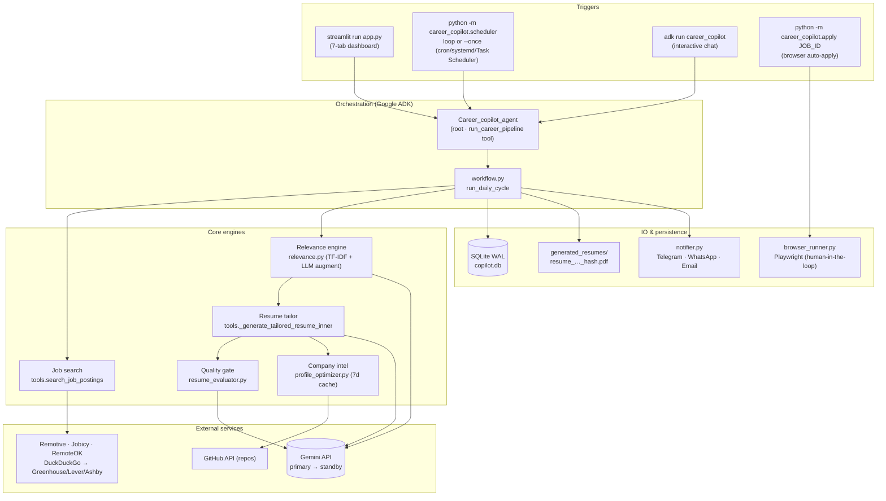
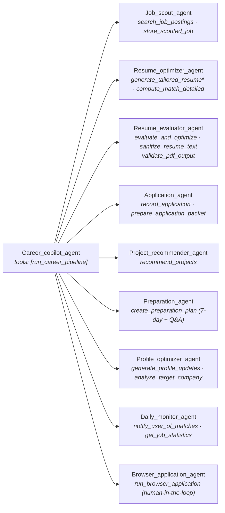
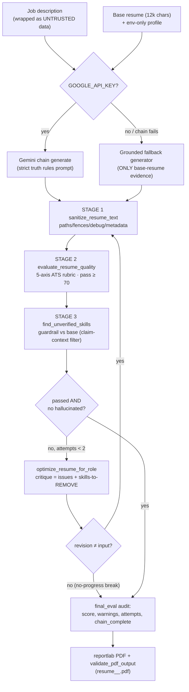
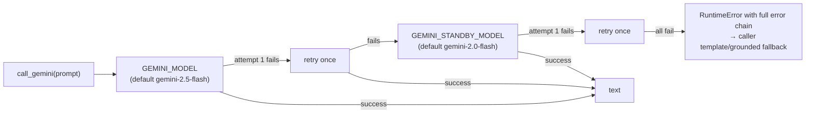
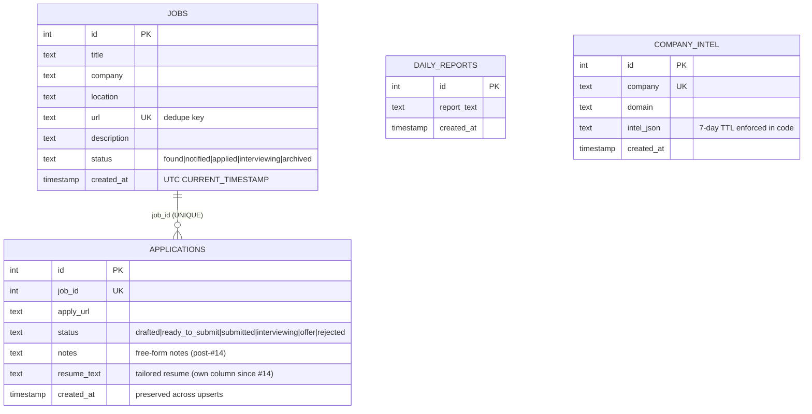

# Career Copilot — System Design & Current-State Audit

**Status:** post-hardening (3 debugging passes complete) · **Branch:** `arena/01a0c85d-resume-agent`
**Verification:** `29/29` regression+unit tests · `12/12` offline evals · evaluator smoke PASS · CI green
**Companion docs:** `PROJECT_REPORT.md` (original 33-item bug audit + errata) · `PORTFOLIO_ROADMAP.md` (roadmap)

---

## 1. Executive Summary

Career Copilot is a **Google ADK multi-agent system that automates the heavy lifting of a job
search**: scouting jobs from live APIs/boards, scoring relevance (deterministic first, LLM
second), tailoring resumes under an anti-hallucination quality gate, pre-filling application
forms in a real browser — with a **human always clicking the final submit** — and delivering
daily digests to Telegram/WhatsApp/Email.

After three debugging passes (33 audit bugs, 11 partial-work items, 8 post-audit criticals),
the system is in a **verified-reliable state**: every fixed failure mode is pinned by an
automated check that runs in CI, and the remaining gaps are either intentional design
(human-in-the-loop submit) or feature work (official board APIs, roadmap items).

### Current-state verdict

| Dimension | State | Evidence |
|---|---|---|
| Crash safety | ✅ No known unguarded crash paths in the daily pipeline | 18 regression tests |
| Hang safety | ✅ Every network call bounded (10–20 s); SMTP fixed | `test_smtp_connection_timeout` |
| Silent-failure safety | ✅ Notify-on-delivery, no-poison cache, failure accounting | regression + evals |
| Hallucination control | ✅ Guardrail 100 % recall @ 0 false positives (offline corpus) | `guardrail_*` evals |
| Scoring integrity | ✅ Bounds 0–100, Spearman 0.750 discrimination | `scorer_bounds`, `discrimination` evals |
| Cost control | ✅ Coarse-to-fine: LLM only re-scores threshold survivors | `test_coarse_pass_never_calls_llm` |
| LLM availability | ✅ Primary → retry → standby model chain | `model_failover` eval |
| Data integrity | ✅ Migrations idempotent, upserts preserve provenance | `test_legacy_db_migration` |
| Ops readiness | ✅ CI workflow, cron-friendly `--once`, entry points | `.github/workflows/ci.yml` |
| Live-network paths | ⚠️ Not exercised here (sandbox is offline) — needs first live run | §2.3 R-1 |

---

## 2. Current-State Audit

### 2.1 Fixed-issue evidence map

All issues from `PROJECT_REPORT.md` §7/§8 plus post-audit sweeps. Each row: **class → fix → proof**.

| Class | Representative fixes | Pinned by |
|---|---|---|
| Scoring correctness | Category clamp 0–100; scorer always runs; experience/excluded-keyword gates unbreachable | `scorer_bounds`, `discrimination`, offline unit tests |
| Cost inversion | Two-phase digest: `use_llm=False` coarse pass for ALL jobs → gate → LLM re-score survivors only → re-gate | `test_coarse_pass_never_calls_llm`, `test_filter_api_is_digest_gate` |
| LLM availability | `config.call_gemini`: per-model retry ×2 → standby failover at all 6 call sites | `model_failover` eval |
| Hallucination | Generate → critique → revise loop (≤3, no-progress break); guardrail wired with claim-context filtering; grounded fallback generator (never claims unowned skills); untrusted-JD delimiters | `guardrail_recall` (100 %), `guardrail_false_positives` (0), `fallback_grounding`, `revise_loop_no_progress` |
| Pipeline hangs | SMTP `timeout=15`; all HTTP 10–20 s; Playwright timeouts everywhere | `test_smtp_connection_timeout` |
| Silent failures | Jobs marked `notified` only when ≥1 channel actually delivered; DDG/provider failure accounting; WhatsApp success = API payload check | `test_matches_keys_semantics`, code review |
| Data integrity | UTC/SQLite date formats in cleanup; `applications.resume_text` column (idempotent `ALTER`, `created_at` preserved); status vocabularies validated both tables | `test_cleanup_date_format`, `test_application_resume_column`, `test_invalid_status_rejected`, `test_application_status_machine`, `test_legacy_db_migration` |
| External-data hazards | Email escapes URL + all job strings; filenames allowlist-charset + length cap + hash suffix (non-ASCII collision/crash fixed); int env parsing crash-safe | `test_email_url_escaping`, `test_resume_filename_collision_proof`, `threshold_safety` eval |
| Scraper fragility | DDG parser attribute-order tolerant (any quote style, extra classes); Jobicy full-phrase query + first-keyword fallback | `test_ddg_parser_attribute_order_tolerant`, `test_jobicy_full_query_first` |
| Latency | Dead company domains short-circuit to 1 fetch (was 5 × retries ≈ 2.5 min); company-intel cache 7-day TTL + unreachable domains never cached | `test_company_analyzer_dead_domain_shortcircuit`, `test_company_intel_cache_ttl_and_poison`, `intel_cache_anti_poison` eval |
| Privacy | PII env-only via `config.get_candidate_profile()`; resume PDFs untracked + git-ignored | `test_candidate_profile_placeholders` |
| Test integrity | Hermetic suites (notification creds stashed); false-green pin repaired (`add_job` returns bool, not id) | the suite itself, 29/29 |
| Ops | `scheduler --once` (exit 0/1) for cron/systemd; CI = compileall → evaluator → regressions → evals; `pyproject.toml` entry points | `test_scheduler_once_mode`, CI runs |

### 2.2 Verification coverage map

| Suite | Count | What it proves | Network/LLM? |
|---|---|---|---|
| `test_regressions.py` | 18 regression | Every fixed bug stays fixed | ❌ hermetic |
| `test_regressions.py` (offline units) | 11 | Scoring discrimination, gates, caching, autofill mappings | ❌ |
| `test_evaluator.py` | smoke | ATS evaluator end-to-end on sample resume | ❌ |
| `evals/` harness | 12 checks | Behavioral contracts: bounds, discrimination (Spearman 0.750), guardrail recall 100 % @ 0 FPs, sanitizer, quality gate, fallback grounding, threshold safety, model failover, revise-loop, cache anti-poison, filename safety | ❌ offline-first |
| `evals/` (optional) | +1 | Real-LLM hallucination rate (needs `GOOGLE_API_KEY`) | ✅ opt-in |
| CI (GitHub Actions) | 1 workflow | All of the above on every push/PR | ❌ |

### 2.3 Remaining risk register

| # | Risk / gap | Severity | Disposition |
|---|---|---|---|
| R-1 | **Live paths unexercised** — real job APIs, Gemini, SMTP, Telegram/WhatsApp, Playwright runs never tested here (sandbox offline) | 🟠 | Do the first live run (`scheduler --once`) on a keyed machine; all offline-verifiable behavior is pinned |
| R-2 | **PII PDFs in git history** — untracked going forward, but present in history | 🟠 | User decision: `git filter-repo` + force-push before going public (see `career_copilot/resume/README.md`) |
| R-3 | **Board jobs now enriched via official APIs** — Greenhouse/Lever public JSON provides authoritative title/company/location/description; DDG scraping remains only as discovery + fallback (hardened, attribute-order tolerant). Ashby has no public per-posting API (scraped data + fallback) | 🟡 | Partially addressed; full migration would need company slugs |
| R-4 | **Never auto-submits** — forms are filled, user clicks submit | — | **Intentional** (human-in-the-loop, §8.12) |
| R-5 | Roadmap features absent (vector-search relevance, resume version history, LinkedIn Easy Apply, voice mock interviews, cloud deploy) | — | Feature work, see `PORTFOLIO_ROADMAP.md` |

---

## 3. System Design

### 3.1 High-level architecture



### 3.2 Agent ↔ tool topology (1 root + 9 sub-agents)



`* generate_tailored_resume` wraps `generate_tailored_resume_with_audit`; the audit dict
(generator used, ATS score, hallucinated skills, attempts) rides with every application packet.

### 3.3 Daily pipeline — two-phase coarse-to-fine (cost-controlled)

```mermaid
sequenceDiagram
    participant SCH as scheduler / UI
    participant WF as workflow.run_daily_cycle
    participant DB as SQLite
    participant SRC as Sources (4 providers)
    participant TR as TF-IDF engine
    participant LLM as Gemini chain
    participant NTF as notifier

    SCH->>WF: run_daily_cycle(query)
    WF->>DB: init_db (idempotent + migrations)
    WF->>SRC: search_job_postings(query)
    Note over SRC: Remotive/Jobicy/RemoteOK direct APIs;<br/>DDG board results enriched via official<br/>Greenhouse/Lever JSON APIs (scraped = fallback)
    SRC-->>WF: jobs[] (dedup'd; provider errors counted)
    Note over WF,TR: PHASE 1 — coarse pass, NO LLM (use_llm=False)
    WF->>TR: filter_jobs_by_relevance(all jobs)
    TR-->>WF: passed / filtered (score 0-100, rejection_reason)
    Note over WF,LLM: PHASE 2 — LLM re-score SURVIVORS only
    loop for each passed job
        WF->>LLM: compute_match_detailed(use_llm=True)
        LLM-->>WF: augmented score (baseline_score kept)
        WF->>WF: re-gate (LLM may only make it stricter)
        WF->>DB: store_scouted_job (INSERT OR skip dup URL)
    end
    WF->>DB: cleanup_old_records (90 days, UTC)
    WF->>NTF: digest (chunked ≤3500 chars, HTML-escaped)
    NTF-->>WF: per-channel delivery booleans
    alt ≥1 channel delivered
        WF->>DB: jobs 'found' → 'notified'
    else all failed
        WF->>WF: leave 'found' (retried next run — no false state)
    end
```

**Why this design:** the LLM never gates the full job list (cost ~10× lower, deterministic
floor); the deterministic engine is always the authority of last resort; notification state
transitions only on real delivery, so outages retry instead of silently dropping jobs.

### 3.4 Resume tailoring — hallucination-reduction process



Guarantees: guardrail **always** runs (never skipped for cost); the fallback generator can
only assert skills evidenced in the base resume; identical revisions stop the loop (no wasted
LLM calls); every packet carries the audit dict for observability.

### 3.5 Model failover chain



Failover triggers on any exception (quota/429, 5xx, empty body). Callers keep deterministic
fallbacks, so LLM total-loss degrades quality — never crashes the pipeline.
Pinned by the `model_failover` eval (`primary, primary, standby` call order).

### 3.6 Browser auto-apply (human-in-the-loop by design)

```mermaid
sequenceDiagram
    participant U as User
    participant CLI as apply.py JOB_ID
    participant BR as browser_runner (Playwright)
    participant DB as SQLite

    CLI->>DB: load job (validated id)
    CLI->>BR: run_browser_application(packet)
    BR->>BR: detect_platform → site-specific selectors<br/>(greenhouse/lever/workday/ashby)
    BR->>U: shows packet summary; type CANCEL to abort
    U-->>CLI: cancel → top-level status=cancelled → exit 0 (reachable!)
    BR->>BR: open page; detect verification/login wall
    alt verification appears
        BR->>U: pause up to 10 min for manual solve
    end
    BR->>BR: autofill fields + upload tailored PDF
    BR->>U: review in browser — USER clicks Submit (NEVER automated)
    U-->>BR: closes browser
    BR-->>CLI: status=filled/unknown
    CLI->>DB: job → 'applied'; applications('drafted') record + resume_text
    Note over U,DB: User later advances: ready_to_submit → submitted →<br/>interviewing → offer/rejected (validated)
```

### 3.7 Data model (SQLite, WAL mode)



Hygiene: `cleanup_old_records(90d)` with format-safe UTC comparisons; both status columns
validated against allowlists (`update_job_status`, `update_application_status`);
`save_application` coerces invalid statuses to `drafted` with a warning.

### 3.8 Reliability pattern catalog

| Pattern | Where | Setting |
|---|---|---|
| HTTP timeouts | `fetch_with_retry`, Telegram/WhatsApp, GitHub, company pages | 10–20 s |
| SMTP timeout | `send_email` | **15 s** (was ∞) |
| Retries + backoff | `fetch_with_retry` | 3 × exponential |
| Bounded loops | critique-revise ≤ 3 with no-progress break; DDG fetch 2 × | — |
| Message chunking | Telegram + WhatsApp | ≤ 3500 chars |
| Escaping/sanitizing | email HTML incl. URL attribute; resume sanitizer each stage | — |
| Cache with TTL + anti-poison | company intel | 7 days; no write when site unreachable |
| Resume text cache | `_extract_resume_text` (mtime invalidation) | ≤ 12 000 chars + truncation warning |
| Idempotent migrations | `init_db` (`ALTER` guarded) | runs every start |
| Env-int crash-safety | `_get_min_match()` | invalid → 40 |
| Model failover | `call_gemini` | retry → standby |
| Status validation | jobs + applications allowlists | reject/coerce + warn |
| Dedup | job URL unique; notify only `found` jobs | — |
| Concurrency | SQLite WAL + 10 s busy timeout | — |
| Path safety | filename allowlist charset + 80-char cap + sha1 suffix | ≤ 100 chars |

### 3.9 Configuration reference (`career_copilot/.env`)

| Variable | Purpose | Default / required |
|---|---|---|
| `GOOGLE_API_KEY` | Gemini chain (absent → deterministic fallbacks) | optional |
| `GEMINI_MODEL` / `GEMINI_STANDBY_MODEL` | primary / standby (standby `""` disables failover) | `gemini-2.5-flash` / `gemini-2.0-flash` |
| `MIN_MATCH_PERCENTAGE` | digest gate (crash-safe parse) | `40` |
| `EXPERIENCE_LEVEL` | target seniority gate | `fresher` |
| `RESUME_NAME/EMAIL/PHONE/LINKEDIN/GITHUB/PORTFOLIO` | candidate profile (**env-only, never hard-coded**) | required for packets |
| `GITHUB_USERNAME` | repo fetch for profile optimizer (falls back to `RESUME_GITHUB`) | optional |
| `TELEGRAM_BOT_TOKEN` / `TELEGRAM_CHAT_ID` | Telegram channel | optional (mock print) |
| `WHATSAPP_TOKEN/PHONE_NUMBER_ID/TO_NUMBER` | Meta Graph API channel | optional (mock print) |
| `SMTP_SERVER/PORT/USERNAME/PASSWORD` + `RECEIVER_EMAIL` | email channel | optional (mock print) |
| `JOB_SEARCH_QUERY` | scheduler query override | `Python Developer` |

### 3.10 Failure-mode matrix

| Failure | System behavior | Pinned by |
|---|---|---|
| Gemini quota exhausted / down | retry → standby → grounded fallback; pipeline completes | `model_failover`, `fallback_grounding` |
| SMTP server hung | 15 s timeout → channel `False` → jobs stay `found` | `test_smtp_connection_timeout` |
| Telegram/WhatsApp down | other channels deliver; not-all-failed ⇒ `notified` | notify-on-delivery tests |
| **All** notify channels down | jobs stay `found`, retried next cycle | code + semantics test |
| Job API down | provider counted; other providers serve; error logged | DDG failure accounting |
| DDG markup changes | attribute-order-tolerant parser keeps extracting | `test_ddg_parser_attribute_order_tolerant` |
| Board enrichment API down | scraped snippet data serves; search never fails | `test_board_api_enrichment` |
| Company site dead | 1 fetch (not 5), empty intel **not cached** | cache TTL/anti-poison tests |
| Malformed `MIN_MATCH_PERCENTAGE` | falls back to 40, never crashes digest | `threshold_safety` |
| Non-ASCII / 300-char job title | unique, ≤100-char filename | `resume_filename_safety` |
| Duplicate job URL | `INSERT` skipped politely (no exception) | add_job bool contract |
| LLM adds unowned skill | guardrail flags → revise with REMOVE critique → audit records | `guardrail_recall` 100 % |
| User cancels apply flow | exit 0, no partial state, no status change | apply cancel path |
| Legacy DB (pre-`resume_text`) | `ALTER` migration, rows preserved, idempotent | `test_legacy_db_migration` |
| Reviser returns identical text | loop breaks after 1 attempt | `revise_loop_no_progress` |

---

## 4. Repository map (top level)

```
Resume-agent/
├── career_copilot/            # package (agents, engines, DB, notifier, browser, evals, tests)
│   ├── evals/                 # offline-first harness (12 checks) + RESULTS.md
│   ├── resume/                # base resume PDFs (git-ignored PII) + README policy
│   └── generated_resumes/     # tailored PDFs (git-ignored, auto-created)
├── .github/workflows/ci.yml   # compile → evaluator → regressions → evals
├── pyproject.toml             # packaging + console entry points
├── PROJECT_REPORT.md          # original audit (33 bugs) + errata index of fixes
├── PORTFOLIO_ROADMAP.md       # agent-honesty audit + upgrade roadmap
└── SYSTEM_DESIGN.md           # this document
```

## 5. How to verify (offline)

```bash
python -m compileall -q career_copilot
python career_copilot/test_regressions.py     # 29/29 (18 regression + 11 offline unit)
python career_copilot/test_evaluator.py       # smoke
python -m career_copilot.evals.run_evals      # 12/12
python -m career_copilot.scheduler --help     # --once documented
```

*Last verified: 2026-09-23 — all suites green on commit `81aab20`.*
